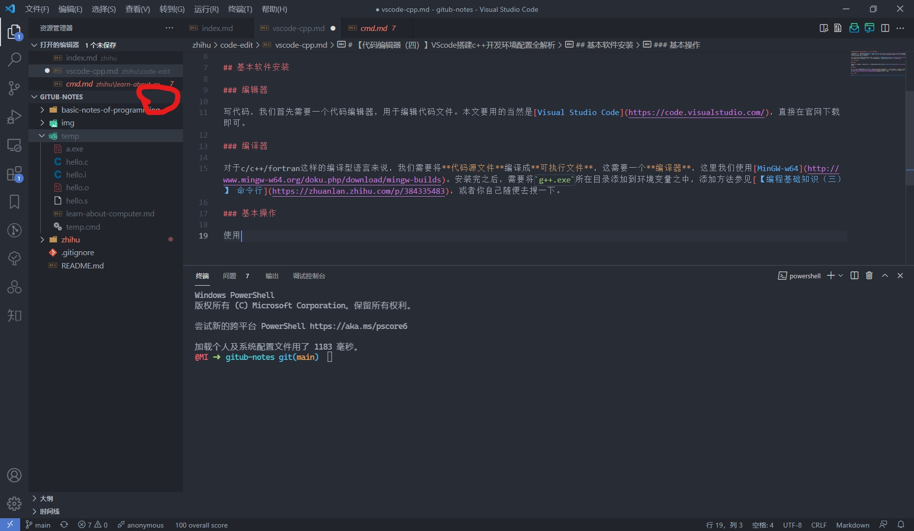

# 【代码编辑（四）】VScode搭建c++开发环境配置全解析

在代码编辑器的第一篇文章——[【代码编辑（一）】Visual Studio Code](https://zhuanlan.zhihu.com/p/386479162)——的最后，我介绍了Visual Studio Code搭建c++开发环境的简单示例。现在我们开始搭建一个较为完备的开发体系，并且我会对其中的很多东西进行较为详细的解释，说明这样配置背后的原理，力图做到授人以渔而不只是授人以鱼。

**阅前须知**：阅读本节之前最好先阅读本系列第三部分：[【编程基础知识（目录）】](https://zhuanlan.zhihu.com/p/384335813)，了解基本的命令行操作。本文不完全是教小白如何搭建一个c++开发环境，更重要的展示使用编辑器搭建某一种语言的开发环境的思路。如果你不喜欢我这么啰嗦，想直接抄作业，请另寻他处。

## 基本软件安装和使用

### 编辑器

写代码，我们首先需要一个代码编辑器，用于编辑代码文件。本文要用的当然是[Visual Studio Code](https://code.visualstudio.com/)，直接在官网下载即可。**注意在安装的时候，把所有的选项全都勾上**，都是很有用的选项。

### 编译器

对于c/c++/fortran这样的编译型语言来说，我们需要将**代码源文件**编译成**可执行文件**，这需要一个**编译器**，这里我们使用[MinGW-w64](http://www.mingw-w64.org/doku.php/download/mingw-builds)。安装完之后，需要将`g++.exe`所在目录添加到环境变量之中，添加方法参见[【编程基础知识（三）】 命令行](https://zhuanlan.zhihu.com/p/384335483)，或者你自己随便去搜一下。

### 基本操作

首先，**不要随便使用菜单栏的新建一个文件操作**。你需要学会使用使用文件夹来管理项目，而不是随手新建一个文件。我们先在文件资源管理器新建一个文件夹，并做一个有意义的命名。然后使用点击这个文件夹右键**通过 Code**打开（如果你安装的时候没有勾选对应的选项就没有这个功能，这时你可以先打开VScode，使用打开文件夹功能来打开这个文件夹）。这样，你就通过VScode打开了一个文件夹，接下来的一些列操作都在这个文件夹内进行。

以上，就是一个最基本的项目管理技能：将有关文件都放在同一个文件夹内。

接下来，将鼠标移到如下图红色圈处，
在这里新建一个文件，将其命名为`hello.cpp`，然后写一个简单的Hello World代码，比如
```cpp
#include <iostream>

int main(){
    std::cout << "Hello, world!" << std::endl;
    return 0;
}
```
接下来使用
```bash
Ctrl + `
```
快捷键，或者使用菜单栏的**终端**一栏打开命令行。使用命令行编译这个`hello.cpp`文件
```bash
g++ hello.cpp -o hello.exe
```
并运行这个可执行文件
```bash
.\hello.exe
```

以上过程包含了代码开发过程中的**编辑-编译-运行测试**的完整过程，虽然现在都不是很高效，但是这三个过程非常的简单清晰。

后面的一系列配置，都不过是使得这个三个步骤更加高效的过程。

## 添加插件

点击VScode左侧边栏的积木图标，即是VScode的插件商店，搜索`c++`，安装其中下载量最高的一个（开发者就是Microsoft）。这个插件提供了c++开发几乎所有需要的辅助功能，我们先从这个插件开始学习。（当然你也可以再装个简体中文插件，用于汉化界面文字。）

> 注意别装那个什么c/c++ Extension Pack插件，当你搞不清楚它有什么用的时候，不要觉得他好像贴心的打包好了很多功能所以我可以无脑用。认真学习每个插件的用途，探索一个适合自己的插件搭配才能够达到最高的效率。

安装了这个插件，你写c/c++代码的时候就会有代码自动提示功能了。同时，你还可以使用长按`Ctrl`鼠标点击某个变量跳转到其定义处（甚至可以跳转到标准库源代码中）。使用快捷键`Shift+Alt+F`可以自动格式化代码。直接在行首输入`main`回车会自动跳出`main`函数的完整写法（相当于封装了一个简单的snippets）。以及在语法错误的地方标红线。等等。。。

以上这些小功能，主要的目的就是帮助我们更加高效的编辑源代码。

### 两个`json`文件

编辑完成之后，就是编译和运行了。一般的VScode搭建c++开发环境的文章这个时候就要搬出两个`json`文件来了，这其实就是VScode官方文档[Get Started with C++ and Mingw-w64 in Visual Studio Code](https://code.visualstudio.com/docs/cpp/config-mingw)里抄过来的。首先，我并不建议使用官方文档的这个做法，但是我还是会解释这两个文件的意义。

#### `tasks.json`

在当前文件夹内新建一个`.vscode`的文件夹（注意开头的英文句号），然后在其中新建`tasks.json`文件，并写入如下内容
```json
{
  "tasks": [
    {
      "type": "cppbuild",
      "label": "C/C++: g++.exe build active file",
      "command": "g++.exe",
      "args": ["-g", "${file}", "-o", "${fileDirname}\\${fileBasenameNoExtension}.exe"],
      "options": {
        "cwd": "${fileDirname}"
      },
      "problemMatcher": ["$gcc"],
      "group": {
        "kind": "build",
        "isDefault": true
      },
      "detail": "g++.exe"
    }
  ],
  "version": "2.0.0"
}
```

这个文件就是所谓的**配置文件**，VScode使用`.vscode`文件夹来统一存放配置文件。其中`.json`是一种常用的数据文件格式，在VScode中特别支持在其中使用`//`来写注释。

而`tasks.json`则是用于配置VScode的`Ctrl+Shift+B`快捷键所执行的任务。`B`这个字母在其他软件通常用于配置`build`相关的行为，在VScode里面通常也是用这个快捷键来编译文件。上述这个`tasks.json`也就是定义了一个编译当前文件的任务。

几个需要解释的字段：
- `command`：是你在命令行运行的那个程序。既然是编译任务，运行的程序当然就是编译器`g++.exe`。
- `args`：是传递给`g++.exe`的命令行参数，其中`${file}`等是VScode定义的一些专门用在配置文件中的变量，`${file}`表示当前聚焦的文件，另外几个变量顾名思义即可。
- `cwd`: 表示`g++.exe`运行的位置。

所以这个任务的意义就是在命令行里面，`cd`到当前聚焦文件（假设是`hello.cpp`）所在的目录，并运行如下的命令行
```bash
g++.exe -g hello.cpp -o hello.exe
```
其中`-g`表示加入调试信息，除此之外和我们之前用的命令行时完全一致。这就是我不建议使用`tasks.json`的原因，每次使用`Ctrl+Shift+B`快捷键之后，还要输入回车才能够继续，实际上更加麻烦。对于单个文件的编译，使用命令行编译实际上更加简单快捷，而对于多文件编译，实际上`tasks.json`也没法很方便的做到，这需要用到另外的方法，我们之后再说。

另外一个需要提一句的是`Code Runner`插件，这个插件用于单个文件的编译和测试运行还算可以，对于多文件项目无能为力。它的一个致命问题是它的结果出现在VScode下面的**输出**窗口，需要输入的程序会被卡住。

#### `launch.json`

`launch.json`是另一个常被提到的配置文件，是用来配置调试的文件，同样放在`.vscode`文件夹内。官网的`launch.json`是这样的
```json
{
  "version": "0.2.0",
  "configurations": [
    {
      "name": "g++.exe - Build and debug active file",
      "type": "cppdbg",
      "request": "launch",
      "program": "${fileDirname}\\${fileBasenameNoExtension}.exe",
      "args": [],
      "stopAtEntry": false,
      "cwd": "${fileDirname}",
      "environment": [],
      "externalConsole": false,
      "MIMode": "gdb",
      "miDebuggerPath": "C:\\your path to ...\\mingw64\\bin\\gdb.exe",
      "setupCommands": [
        {
          "description": "Enable pretty-printing for gdb",
          "text": "-enable-pretty-printing",
          "ignoreFailures": true
        }
      ],
    //   "preLaunchTask": "C/C++: g++.exe build active file"
    }
  ]
}
```
其中我修改了两个位置，一个是`miDebuggerPath`字段，表示调试器位置，请自行改成你自己的调试器位置。另一个是注释了`preLaunchTask`字段，它表示在调试之前，先运行一个任务：`C/C++: g++.exe build active file`，这也就是我们上面提到的`tasks.json`定义的任务。既然我建议使用命令行直接编译，不再使用`tasks.json`以及快捷键`Ctrl+Shift+B`，那么我们自然也不需要事先运行这个任务。

几个需要解释的字段：
- `program`: 调试的程序。
- `args`: 程序的命令行参数。如果你的程序需要命令行参数，那么调试的时候就在这里添加，注意每个参数单独作为一个字符串，比如`"args": ["-o", "output.txt"]`。
- `cwd`: 调试程序运行的位置，这需要与调试的程序匹配。比如程序逻辑里面有读取当前文件夹下的某个文件`data.txt`，那么`cwd`肯定就要设置为`data.txt`所在的位置。

### 单个`.cpp`文件编译调试步骤小结

如果你不想使用复杂的调试功能，只想运行一下测试结果
- 首先，新建一个`hello.cpp`文件，愉快的使用代码提示功能写一个程序。
- 然后，在命令行使用`g++ hello.cpp -o hello.exe`编译这个`.cpp`文件得到可执行程序。
- 最后，在命令行运行程序：`.\hello.exe`。

如果你写的程序比较复杂，需要断点调试查找错误
- 首先，新建一个`hello.cpp`文件，愉快的使用代码提示功能写一个程序。
- 接着，在命令行使用`g++ -g hello.cpp -o hello.exe`编译这个`.cpp`文件得到可执行程序。（注意`-g`参数表示添加调试信息，不加这个参数会无法调试。）
- 然后，在VScode编辑区，行号前面添加断点。
- 最后，在`.vscode`文件夹内新建一个`launch.json`文件，内容如前。然后使用`F5`快捷键，或者使用菜单栏的`运行-启动调试`开始调试。

是的，官网的两个`.json`文件其实并不适合新手，实际上也并不是最佳实践。如果你是新手，那么`Code Runner`插件也许还可以用一下。如果你熟悉命令行，那么上述步骤就是VScode写c++小程序的最佳实践了。

## 多文件项目的开发环境配置

VScode进行c++开发的能力当然不仅限于单个文件小程序的开发，大型项目也是可以的。需要提前声明的是，组织c++大型项目的方式在c++社区是有很多分歧的，不同的人偏好不同。我只简单的写一写我目前在使用的`cmake`配置方法，仅供参考。

### `make`的简单使用

[GNU Make](https://www.gnu.org/software/make/)是一个较为古老的构建工具，用于组织多文件项目的编译。使用GNU Make需要写一个配置文件`Makefile`（全名，注意大小写，没有拓展名），用于定义编译步骤。`cmake`最终也是生成`Makefile`然后再调用GNU Make软件来编译的，所以我们需要先学习GNU Make的使用。

在前面我们安装的MinGW-w64组件里面包括了GNU Make软件在Windows下的移植，不过他的名字是`mingw32-make.exe`。为了在命令行能够使用更加通用的`make`命令，可以去安装目录下把`mingw32-make.exe`改名为`make.exe`，不会影响使用。

在本系列的[【程序的运行（三）】编译多文件项目](../let-the-program-run/compile-multi-file-project.md)文章中，我给出了一个多文件项目的例子以及对应`Makefile`的写法，以及`Makefile`编写的教程链接。这里仅仅给出使用`make`的基本流程。
- 首先，使用VScode打开一个空文件夹，创建几个`.cpp, .h`文件等，愉快的开始写代码。
- 根据项目结构写好`Makefile`。
- 在命令行使用命令`make`编译项目。
- 在命令行测试程序，或者书写`launch.json`进行调试。

### `cmake`构建工具的使用

`cmake`当然也是一个软件，去[cmake官网](https://cmake.org/)下载安装这个软件，同样需要添加到环境`PATH`中去。`cmake`也需要写一个配置文件`CMakeLists.txt`（注意大小写）。关于如何写，github上的项目[cmake-examples](https://github.com/ttroy50/cmake-examples)给出了`cmake`的基本使用方法，非常适合学习如何使用`cmake`。

命令行`cmake`使用的基本流程是
- 首先，使用VScode打开一个空文件夹，创建几个`.cpp, .h`文件等，愉快的开始写代码。
- 根据项目结构写好`CMakeLists.txt`。
- 在项目所在文件夹新建一个子文件夹`build`用于存放编译的中间文件，命令行`cd`到这个`build`文件夹，使用命令`cmake ..`生成`Makefile`文件。
- 使用命令`make`编译整个项目。
- 在命令行测试程序，或者书写`launch.json`进行调试。

在VScode中使用`cmake`，为了利用图形界面的鼠标操作，可以安装VScode的插件`CMake Tools`（作者是Microsoft），通常为了`CMakeLists.txt`写起来舒服还可以安装插件`CMake`，但不是必须。这两个常见是插件商店搜索`cmake`下载量最大的两个插件。

安装了`CMake Tools`插件之后，只要你的文件夹下写好了`CMakeLists.txt`，插件就会自动生成`build`文件夹，并生成`Makfile`文件。此时VScode的底边栏就会出现一系列按钮，你可以自行探索每个按钮的意义，可以使用这些按钮更改编译类型（Debug或者Release），编译整个项目等等。

