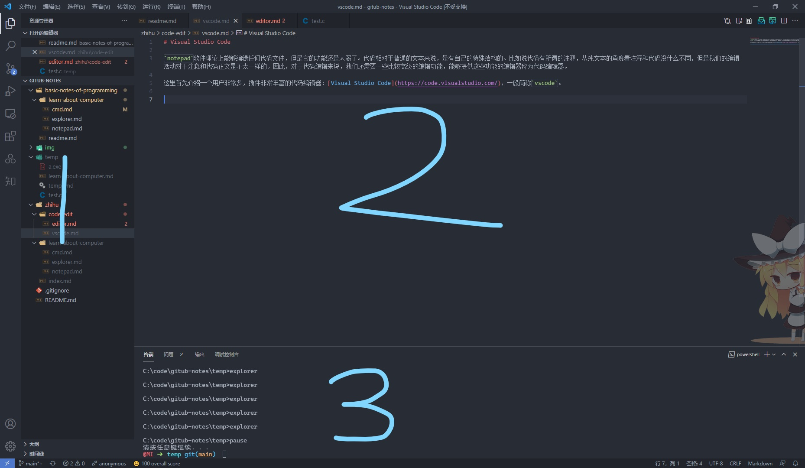
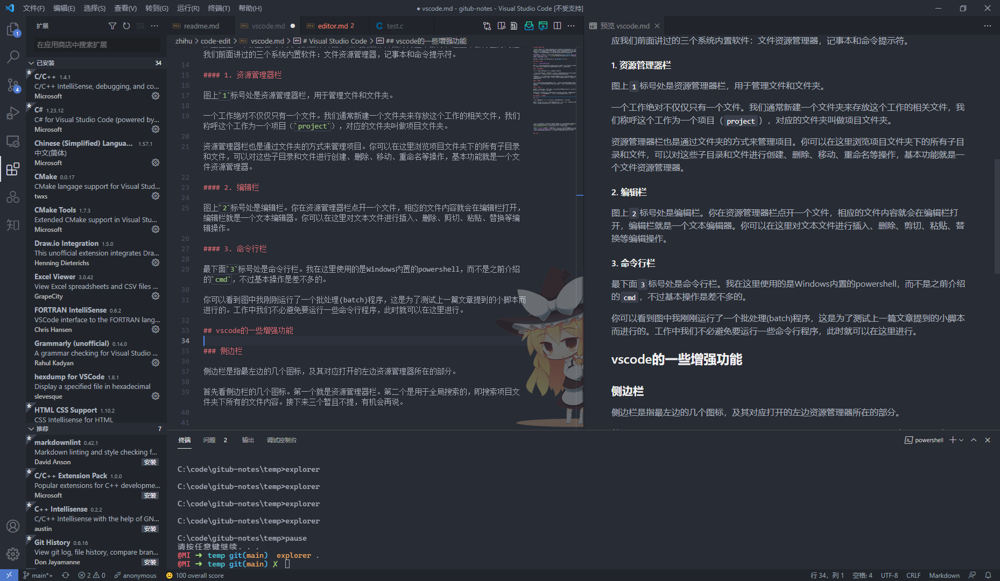
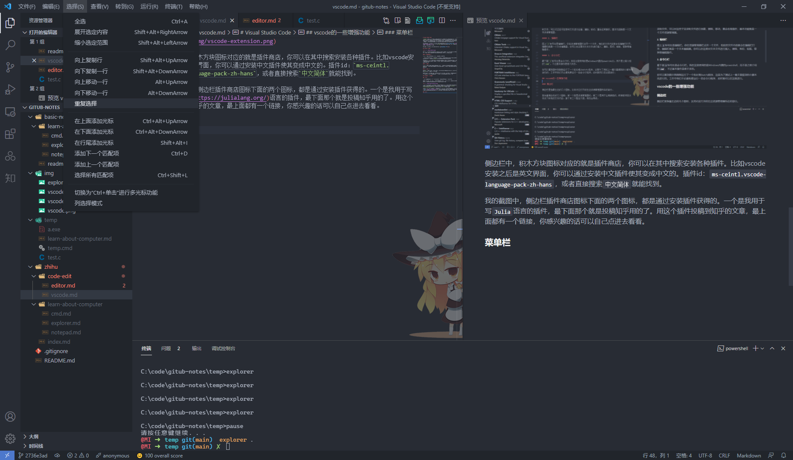
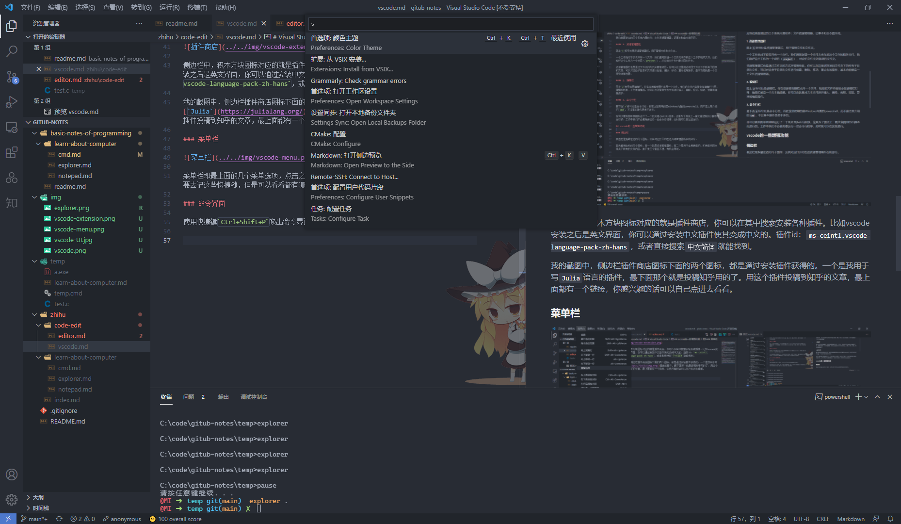

# 【代码编辑（一）】Visual Studio Code

`notepad`软件理论上能够编辑任何代码文件，但是它的功能还是太弱了。代码相对于普通的文本来说，是有自己的特殊结构的。比如说代码有所谓的注释，从纯文本的角度看注释和代码没什么不同，但是我们的编辑活动对于注释和代码正文是不太一样的。因此，对于代码编辑来说，我们还需要一些比较高级的编辑功能，能够提供这些功能的编辑器称为代码编辑器。

这里首先介绍一个用户非常多，插件非常丰富的代码编辑器：[Visual Studio Code](https://code.visualstudio.com/)，一般简称`vscode`。先去上述网站下载安装一下吧，推荐安装的时候把所有的选项全都勾上。

如果你对于vscode不感兴趣，可以直接看下一篇[代码编辑器概述](editor.md)。

## vscode基本界面



如上图是一个我正在写本文时的工作界面，常用的工作界面分为三个部分，这三个部分正好对应我们前面讲过的三个系统内置软件：文件资源管理器，记事本和命令提示符。

#### 1. 资源管理器栏

图上`1`标号处是资源管理器栏，用于管理文件和文件夹。

一个工作绝对不仅仅只有一个文件。我们通常新建一个文件夹来存放这个工作的相关文件，我们称呼这个工作为一个项目（`project`），对应的文件夹叫做项目文件夹。

资源管理器栏也是通过文件夹的方式来管理项目。你可以在这里浏览项目文件夹下的所有子目录和文件，可以对这些子目录和文件进行创建、删除、移动、重命名等操作，基本功能就是一个文件资源管理器。

#### 2. 编辑栏

图上`2`标号处是编辑栏。你在资源管理器栏点开一个文件，相应的文件内容就会在编辑栏打开，编辑栏就是一个文本编辑器。你可以在这里对文本文件进行插入、删除、剪切、粘贴、替换等编辑操作。

#### 3. 命令行栏

最下面`3`标号处是命令行栏。使用快捷键
```
Ctrl+`
```
打开命令行栏。我在这里使用的是Windows内置的powershell，而不是之前介绍的`cmd`，不过基本操作是差不多的。

你可以看到图中我刚刚运行了一个批处理(batch)程序，这是为了测试上一篇文章提到的小脚本而进行的。工作中我们不必避免要运行一些命令行程序，此时就可以在这里进行。

## vscode的一些增强功能

### 侧边栏

侧边栏是指最左边的几个图标，及其对应打开的左边资源管理器所在的部分。

首先看侧边栏的几个图标。第一个就是资源管理器栏。第二个是用于全局搜索的，即搜索项目文件夹下所有的文件内容。接下来三个暂且不提，有机会再说。



侧边栏中，积木方块图标对应的就是插件商店，你可以在其中搜索安装各种插件。比如vscode安装之后是英文界面，你可以通过安装中文插件使其变成中文的。插件id：`ms-ceintl.vscode-language-pack-zh-hans`，或者直接搜索`中文简体`就能找到。

我的截图中，侧边栏插件商店图标下面的两个图标，都是通过安装插件获得的。一个是我用于写[`Julia`](https://julialang.org/)语言的插件，最下面那个就是投稿知乎用的了。用这个插件投稿到知乎的文章，最上面都有一个链接，你感兴趣的话可以自己点进去看看。

最底下的两个图标，分别是账号界面和设置界面。你可以登录微软账号来同步`vscode`设置，通过设置界面对你的`vscode`进行调教。

### 菜单栏



菜单栏即最上面的几个菜单选项，点击之后又很多的操作，大部分都有对应的快捷键。并不一定要去记这些快捷键，但是可以看看都有哪些操作，记一些你自己可能常用的操作。

### 命令界面



使用快捷键`Ctrl+Shift+P`唤出命令界面。这里有很多菜单栏没有的操作，最重要的是插件提供的很多功能可以在这里找到。

试着唤出命令界面，输入`theme`回车（装了中文插件之后，使用中文`主题`也可以），给你的`vscode`换个颜色主题吧。

## c++配置示例

接下来简单介绍一下使用`vscode`配置c++编程环境的基本步骤。其实网上都很多类似教程，搜索`vscode c++`就有大把大把的。我这里仅仅是为了展示一下如何使用`vscode`的上述基本操作。

### gcc编译器安装

首先去下载安装一个编译器：[MinGW-w64](http://www.mingw-w64.org/doku.php/download/mingw-builds)。编辑器仅仅是编辑代码，c++代码要运行起来，还需要编译器将其编译成可执行程序。

安装之后，你需要找到`MinGW-w64`安装目录下的`gcc.exe, g++.exe`等程序所在的文件夹，将其添加到`PATH`变量中去。具体操作请看我上一篇文章[命令提示符](https://zhuanlan.zhihu.com/p/384335483)。

### vscode配置

搜索安装c++插件：`ms-vscode.cpptools`，或者直接搜索`c++`，安装下载量最高的那个。这个插件提供写c++程序的很多高级功能。

然后新建的一个文件夹`test-cpp`，作为你的项目文件夹。在`vscode`菜单栏，点击`文件->打开文件夹`，打开你刚才新建的这个`test-cpp`文件夹。

在侧边栏资源管理器处找到新建文件按钮，新建一个c++文件`test.cpp`，愉快的写下一个Hello world程序。

使用快捷键打开命令行，或者点击菜单栏：`终端->新终端`打开命令行。在这里输入编译命令
```bash
g++ test.cpp -o test.exe
```
这样你会在当前目录下得到一个`test.exe`的可执行程序。

还记得我们之前说过，没有添加到`PATH`变量的程序需要通过指定绝对路径或者相对路径来运行，因此我们可以在命令行使用
```bash
.\test.exe
```
来运行这个程序。

至此你已经学会了使用`vscode`编辑，编译，运行c++程序的基本步骤了。

## 总结

本文介绍了`vscode`编辑器的基本操作，并通过使用`vscode`配置c++编程环境来复习了前面学到的一些知识。

如果想要进一步学习`vscode`的相关知识，建议直接去看[`vscode`官方文档](https://code.visualstudio.com/docs)。其中就有非常详细的c++, python, java等语言开发环境搭建的相关配置。

搭建`Fortran`开发环境，建议看我之前写的一篇文章[搭建fortran开发环境](https://zhuanlan.zhihu.com/p/133302241)，配合`vscode`官方文档中c+++开发环境部分更好。