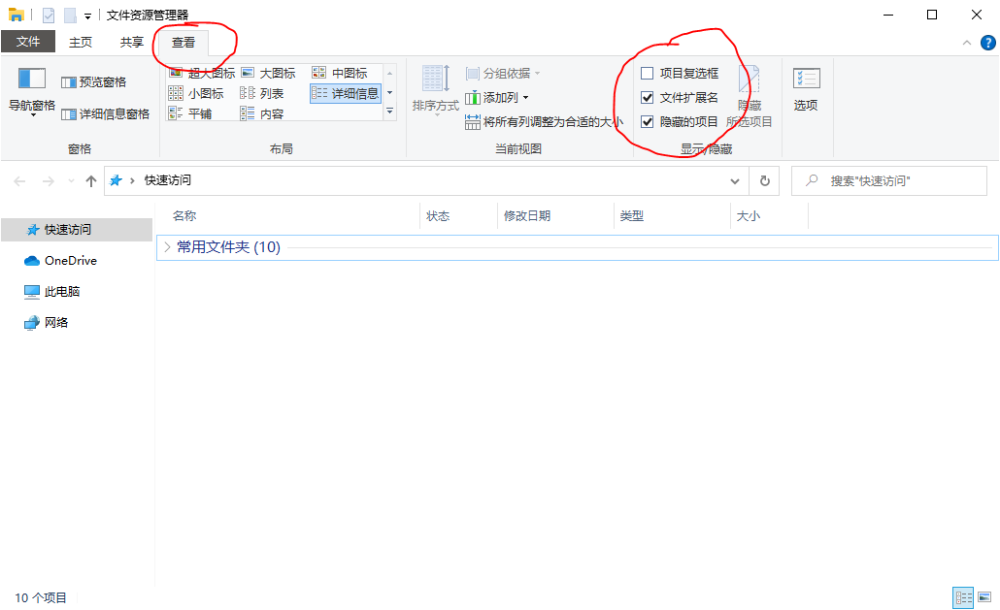

# 【编程基础知识（一）】 文件和文件夹

要学习编程，首先要熟悉计算机。首先我以Windows上的三个系统内置软件为线索，介绍计算机的一些基本操作，linux和mac上，这三种软件也都有对应的。目的不是为了学习软件的使用，而是为了由此引出一些基本概念和知识。

> 先普及一个小知识，windows左下角有个搜索框，里面可以搜索windows中已经安装的软件以及各种其他的东西。一下三个软件不用安装，是windows自带的，你都可以通过在搜索框中搜索其中文名或者我括号中给出的英文名打开。你也可以使用快捷键`win+q`快速聚焦到搜索框。

让我们先看看文件资源管理器。

## 文件资源管理器(`explorer`)

首先是"文件资源管理器"，英文名叫`explorer`。在windows系统的搜索界面，输入"文件资源管理器"或者`explorer`，就可以打开这个软件。当你打开之后，会看到一个熟悉的窗口，这不就是双击"此电脑"弹出来的软件吗。确实如此，不过"文件资源管理器"这个名字更能说明它的用途——用来管理计算机上的文件资源的软件。

文件资源管理器想必大家都很熟悉，我们通过它来访问计算机上的文件。**计算机上所有的数据资源都是以文件的形式存在的**，它们以树状结构被管理起来：`C:`盘下放着几个大文件夹，文件夹下面有子文件夹，这样层层嵌套，最末端是一个个文件。

当然Windows不完全是文件树，其最顶层还有一个盘符的概念，和硬件有一定的关联。但是基本的树状结构大家应该都能够理解。

> 有的时候，我们下载了奇怪的东西，导致出现了奇怪的弹窗。此时可以搜索打开"任务管理器"软件，在这个软件上找到弹窗对应的软件，右键->打开文件所在位置，就能够看到这个弹窗实际是哪个文件产生的效果。大多数时候，删掉那个文件，就能够解决掉这个弹窗。因此还是想强调那句话，电脑上的资源都是以文件的形式存在的，计算机并不复杂，掌握了文件，就掌握了计算机的绝大多数功能了。

## 文件资源管理器的基本操作

文件资源管理器主要是对文件整体进行一些操作，包括：**复制、剪切、粘贴、创建、删除、重命名**等等。这些大家都很熟悉，下面介绍文件资源管理器的几个有用的设置

有价值的设置就是上图红圈部分，分别解释一下

#### a. 项目复选框

这个就没必要选了，长按`Ctrl`同时鼠标点击就可以多选，长按`Shift`同时鼠标点击就可以选一排，这些快捷操作比复选框快多了。

#### b. 文件拓展名（文件后缀）

所谓文件拓展名就是文件名末尾最后一个英文句号`.`之后的内容。当你勾上图中的选项，你会发现原来的文件名后面多出来一些字母，这就是文件扩展名。word文件的扩展名是`.doc`或者`.docx`，PDF文件的拓展名就是`.pdf`，常用的图片文件扩展名有`.jpg, .png, .gif`等等。

我推荐大家显示文件拓展名，那么文件拓展名有什么用呢？

我们都知道计算机的基础是二进制，**计算机上的一切文件当然也是以二进制的形式存在的**。文件和文件本质上没有区别，但是有个文件双击，会被word打开；有的文件双击，会被视频播放器打开。这是因为他们的文件拓展名不同。

一般来说，一种文件拓展名是和打开它的软件绑定的。比如说`.doc,.docx`文件默认软件就是word，`.pdf`文件默认软件就是某种PDF阅读器。有的人可能会说，起作用的不是文件拓展名，而是文件的图标，你可以试着修改一个`.docx`文件的拓展名为`.pdf`，你会发现图标也跟着变了。图标只是方便辨认的一个标识，真正起作用的还是文件拓展名。

> 实际上文件的图标在拓展名不变的情况下，也是可以改变的。有的时候，一些病毒实际上是破坏性的程序，但是它的图标可能看上去就是一个普通的word文档或者视频文件。这个时候你双击它，就会激活这个病毒，破坏你的电脑。因此，让文件资源管理器显示拓展名，你一眼就可以看出它不是一个正常的word文档，也算是一种发现病毒的方法。

> 当你试着修改文件拓展名时，windows可能会提醒你这样会损坏文件，其实是不会的。文件拓展名也是文件名的一部分，**修改文件拓展名并不会修改文件内容**。其实你可以把你的`学习资料.mp4`改成`学习资料.pptx`传到百度网盘，以此躲开百度网盘的审查。下载回来后，重新改成`.mp4`就好了，这并不会改变文件内容。现在百度似乎能够识别这种操作，不过这种方法和压缩包方法结合起来，成功率比较高。

文件后缀和软件的绑定，只是操作系统的一个约定，是可以改变的，对于一个文件，`右键->属性->打开方式`，就可以修改文件的打开方式。

当然，理解和运用以上这些操作，前提就是你勾上**文件拓展名**这个选项。显示文件扩展名更加重要的一点是，我们编程的时候会接触各种各样的文件扩展名，有时候操作系统并没有给所有的扩展名都配一种图标。所以你必须通过扩展名来识别文件，以此来管理你的程序项目。

#### c. 隐藏的项目

也就是隐藏文件和隐藏文件夹，这个看起自己习惯勾还是不勾。这里主要是介绍相关知识。

Windows下隐藏文件，右键就可以了。linux下的隐藏文件则是以英文句号开头的所有文件和文件夹自动隐藏。

你可能会在某些使用需要找到`C:\Users\账号名\AppData`这个文件夹，或者`C:\ProgramData`文件夹，他们都是隐藏文件，只有勾了**隐藏的项目**选项才能看到。总之如果你不是自己要隐藏什么学习资料，勾上这个选项也不吃亏。

## 个人账户目录

上面提到了`C:\Users\账号名`文件夹，非常值得说一说。这个文件夹一般叫`HOME`目录，中文似乎没什么统一的说法，我这里就叫个人账户目录吧。

linux用户的大多数文件操作一般都会在这个`HOME`目录及其子目录下进行。对于习惯了分盘的Windows用户来说，可能更喜欢在`D:`盘放文件。这两者都是尊重系统规律的正确实践。

`HOME`目录的特殊之处在于，一些软件的配置文件会放在这个目录下面。

如果你是`python`用户，想必都会装`jupyter`和`matplotlib`这两个库，你会在`HOME`目录下看到`.jupyter`文件夹和`.matplotlib`文件夹。这本来是按照linux的习惯设置成隐藏文件夹的，但是Windows的隐藏逻辑是不一样，所以并不是隐藏文件。

请记住这个`HOME`目录，今后我会经常和他打交道。

### 家庭作业

试着打开`C:`盘根目录，看看其中有哪些文件夹，依次点开每一个文件夹，看看里面的内容，思考一下根目录下这些文件夹的作用。最后使用搜索引擎搜索一下，比如"C盘中`Program Files`文件夹有什么作用"。

---------

## 一些小知识

1. 文件资源管理器除了用来浏览文件，还加了一些高级功能。在文件路径栏`ftp`地址，可以作为一个简陋的`ftp`客户端。
2. 如果你装了[WSL](https://docs.microsoft.com/zh-cn/windows/wsl/install-win10)，地址栏输入`\\wsl$`，可以进入这个子系统目录。
3. 文件资源管理器内置了一些功能，比如双击可以直接打开`.zip`压缩文件（如果你电脑装了其他压缩软件，可能会变成使用那个压缩软件打开）。再比如，`.iso`文件（又叫镜像文件），相当于一张虚拟光盘，也可以在文件资源管理器内双击打开，此时文件资源管理器成为了一个虚拟光驱。
