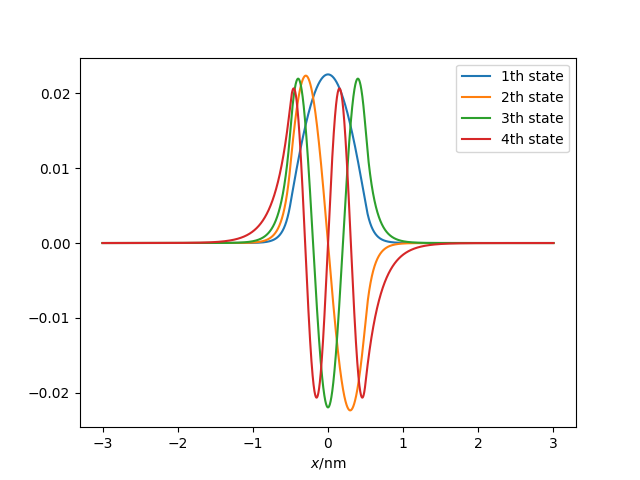

# 一维薛定谔方程（其一）

我们知道薛定谔方程是一个本征值问题，在量子力学课程上也学习了一些特殊势阱的解析求解。但是解析求解是有极限的，一些复杂的势阱是没办法进行解析计算。我们就从一维薛定谔方程开始，讲讲计算方法在物理学中的运用。

## 一维有限深方势阱

一维方势阱可以进行一定程度的解析计算，最后会遇到一个超越方程，不过可以讨论束缚态解的个数。这正好可以作为一个解析求解和数值计算互相验证的例子。

考虑一个有限深方势阱
$$
V(x) = \begin{cases}
-V_0, & |x| < a/2 \\
0, & |x| > a/2
\end{cases}
$$
对于束缚态，有（参考曾谨言《量子力学》（卷一））
$$
\psi(x) \propto \begin{cases}
\cos kx / \sin kx, & |x| < a/2 \\
e^{\pm\beta x}, & |x| > a / 2
\end{cases}
$$
其中
$$
\beta = \sqrt{-2mE}/\hbar, \quad k = \sqrt{2m(V_0+E)}/\hbar
$$
令
$$
\xi = ka/2, \quad \eta = \beta a/2
$$
则有结论（具体推导见曾谨言《量子力学》），对于偶宇称态
$$
\xi \tan \xi = \eta, \quad \xi^2 + \eta^2 = mV_0^2 a^2 / 2\hbar
$$
对于奇宇称的态
$$
-\xi \cot \xi = \eta, \quad \xi^2 + \eta^2 = mV_0^2 a^2 / 2\hbar
$$

求解这几个超越方程就可以解除本征态的能级了。

## 数值求解

接下来介绍一种数值求解方法。考虑一维薛定谔方程
$$
[-\dfrac{\hbar}{2m}\nabla^2 + V(x)] \psi(x) = E\psi(x)
$$
基本的想法是将这个微分方程离散化，取一系列离散的点
$$
x_0 \\
x_1 = x_0 + \Delta x \\
x_2 = x_0 + 2\Delta x \\
\dots \\
x_n = x_0 + n\Delta x
$$
并定义对应的函数值为
$$
    \psi_i \equiv \psi(x_i), \quad i = 0, 1, 2, \dots, n
$$

二阶导数项表示为
$$
\nabla^2\psi(x_i) \approx \dfrac{\psi(x_i+\Delta x) - 2\psi(x_i) + \psi(x_i-\Delta x)}{(\Delta x)^2} = \dfrac{\psi_{i+1}+\psi_{i-1} - 2\psi_i}{(\Delta x)^2}
$$
于是薛定谔方程可以离散为
$$
\left[\dfrac{\hbar^2}{2m}\dfrac{2}{(\Delta x)^2} + V(x_i)\right]\psi_i - \dfrac{\hbar^2}{2m}\dfrac{1}{(\Delta x)^2}(\psi_{i-1} + \psi_{i+1}) = E\psi_i
$$
这构成了一个矩阵形式的久期方程
$$
\boldsymbol{H}\vec{\psi} = E\vec{\psi}
$$
其中
$$
\boldsymbol{H} = \begin{pmatrix}
    d_0 & e \\ 
    e & d_1 & e \\ 
      & e & d_2 & e \\
      & & \ddots & \ddots & \ddots \\
      & & & e & d_{n-1} & e \\
      & & & & e & d_n 
\end{pmatrix}
, \quad \vec{\psi} = \begin{pmatrix}
    \psi_0 \\ \psi_1 \\ \psi_2 \\ \vdots \\ \psi_{n-1} \\ \psi_n
\end{pmatrix}
$$
需要注意的是，这里我们假定，在边界处波函数为零，也就是$\psi(x_0 - \Delta x) = \psi(x_n + \Delta x) = 0$. 而矩阵$\boldsymbol{H}$中的矩阵元即为
$$
d_i = \dfrac{\hbar^2}{2m}\dfrac{2}{(\Delta x)^2} + V(x_i) \\
e = - \dfrac{\hbar^2}{2m}\dfrac{1}{(\Delta x)^2}
$$

最终这个薛定谔方程的求解变成了求解这个对称三对角矩阵的特征值和特征向量。


## 代码和结果

```julia
using LinearAlgebra
using PyPlot
using Roots

# 尽管很多时候我们不会使用国际单位制，这里我们为了代码与公式更好的对应，
# 以及降低理解难度，我们统一采取国际单位制

const ħ = 1.05457e-34
const mₑ = 9.10938e-31
const eV = 1.60217e-19
const nm = 1e-9

# 有限深方势阱参数
const V₀ = 5eV
const a = 1nm

# 离散化点数（实际是 2N + 1）
const N = 10000

function V_well(x::AbstractFloat)
    abs(x) < a / 2 ? -V₀ : 0.
end

"有限深方势阱的解析解（虽然求解超越方程是数值的）"
function exact_well()
    c = mₑ * V₀ * a^2 / 2ħ^2
    f(ξ) = ξ*tan(ξ) - √(c - ξ^2)
    g(ξ) = -ξ*cot(ξ) - √(c - ξ^2)
    even_ξ = fzeros(f, 0, √c)
    odd_ξ = fzeros(g, 0, √c)
    # 由于函数性质比较奇异，可能会出现一些奇怪的根，将其去掉
    deleteat!(even_ξ, @. abs(f(even_ξ)) > 1)
    deleteat!(odd_ξ, @. abs(g(odd_ξ)) > 1)
    even_energy = @. 2even_ξ^2 * ħ^2 / (a^2 * mₑ) - V₀
    odd_energy = @. 2odd_ξ^2 * ħ^2 / (a^2 * mₑ) - V₀
    for (i, e) in enumerate(even_energy)
        println("$(i)th even parity state is $(e/eV)eV")
    end
    for (i, e) in enumerate(odd_energy)
        println("$(i)th odd parity state is $(e/eV)eV")
    end
end

function solve_1d(V::Function, x0::AbstractFloat)
    @assert x0 > 0
    Δx = x0/N
    x = -x0:Δx:x0
    t = ħ^2 / (2mₑ * Δx^2)
    d = @. V(x) + 2t
    H = SymTridiagonal(d, -t * ones(length(x)-1))
    eigen(H, -V₀, 0.)
end

function main()
    # exact solve
    exact_well()
    # numeric solve
    x0 = 3nm
    x = collect(-x0:x0/N:x0) ./ 1nm
    vals, vecs = solve_1d(V_well, x0)
    for (i, e) in enumerate(vals)
        println("$(i)th bound state energy is $(e/eV)eV")
        plot(x, vecs[:, i], label = "$(i)th state")
    end
    xlabel(raw"$x$/nm")
    legend()
    savefig("well.png")
end

main()
```

结果如下
```text
1th even parity state is -4.728195972521942eV
2th even parity state is -2.62079232761458eV
1th odd parity state is -3.9226030954940785eV
2th odd parity state is -0.9406545178374377eV
1th bound state energy is -4.728150007921416eV
2th bound state energy is -3.922423675403684eV
3th bound state energy is -2.6204105080548143eV
4th bound state energy is -0.9400785731389238eV
```



#### 结果讨论

可以看到，数值求解与解析解符合的还是很好的。其中有几点需要注意的是

- 坐标空间离散化之后求解出的波函数并不是归一化的，应该按照概率积分做一次归一化，不过大多数时候这并不重要。（这里作出的波函数图也并没有归一化）
- 方势阱边缘处的二阶微分并不是连续的，不过这并不重要，反正波函数都已经离散了。解出来的波函数在势阱边缘处肯定会有点小瑕疵，但不影响结果的正确性。
- 在代码中，我们设定$\pm x_0$处的波函数为零。如果我们扩大$x_0$的范围，得到的结果将会更加精确。毕竟$x_0$处的波函数并不为零，势阱外的波函数是指数衰减的。
- 代码中，修改$N$的大小，即离散点数的多少对于结果的影响不大。这也印证了上一点，即求解误差主要是截断波函数带来的，而不是离散化带来的。
- 我们仅计算了束缚态。但是三对角矩阵的本征值显然不止这么多，那些大于零的本征值是什么呢？它们什么也不是。硬要说的话，可以看成在$\pm x_0$之外有无限大势垒时的本征态，因为我们强硬地规定了边界处的波函数为零。

最后，从代码中可以看到，`solve_1d`可以求解任意的一维势阱，只要你给出势阱函数和求解范围就好了，感兴趣的可以自定义一个势阱自己试试看。这也是数值求解方法强大的地方。

### 关于Julia语言的备注

代码中`eigen(H, -V₀, 0.)`是指求解矩阵在`[-V₀, 0.]`范围内的特征值。由于实对称矩阵的特征值总是实数，所以是可以排序的。并且也有专门的算法仅计算某个范围内的特征值和对应的特征向量。你可以用`eigen(H, 1:4)`计算前4个特征值和对应的特征向量。

在我们的例子中，我们仅需要求解束缚态的能级，所以只需要计算特征值为负数的这些本征态就好了。而从物理原理我们知道，粒子的能级必然是大于`-V₀`的，你也可以试着直接用`eigen(H)`求解所有的本征态，你会看到确实所有的能级都大于`-V₀`.

求解对称三对角矩阵的特征值和特征向量有专门的算法。Julia中有对称三对角矩阵的抽象`SymTridiagonal`，当然背后求解调用的是LAPACK。Python的scipy的[scipy.linalg.eigh_tridiagonal](https://docs.scipy.org/doc/scipy/reference/generated/scipy.linalg.eigh_tridiagonal.html)的文档对此有详细说明，这也是python求解对称三对角矩阵的方法。c++的Eigen3也有对应的`SelfAdjointEigenSolver<MatrixXd>::computeFromTridiagonal`函数。

我觉得最优雅的还是Julia的做法，因为`eigen`函数传入的是一个（抽象的）矩阵，不像其他两个函数传入的是两个向量。当然大家都是LAPACK，效率倒是没啥好比的。

另外，在代码中我使用了很多Unicode字符来对应公式里面的符号，所以看起来或许和一般的编程语言有点差别。这也是我非常喜欢Julia的一点。目前最好还是用vscode来输入这些字符。
