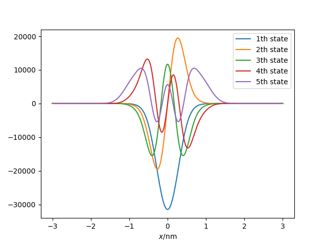
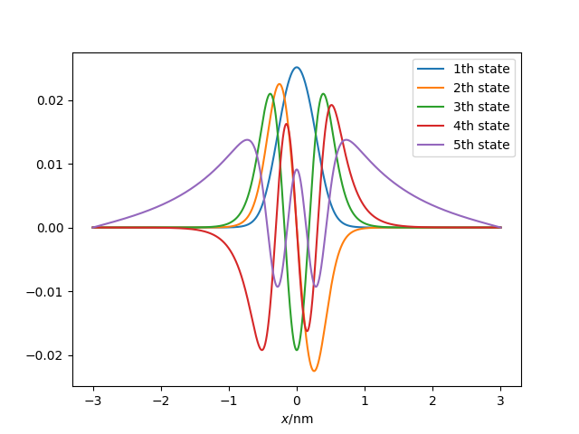
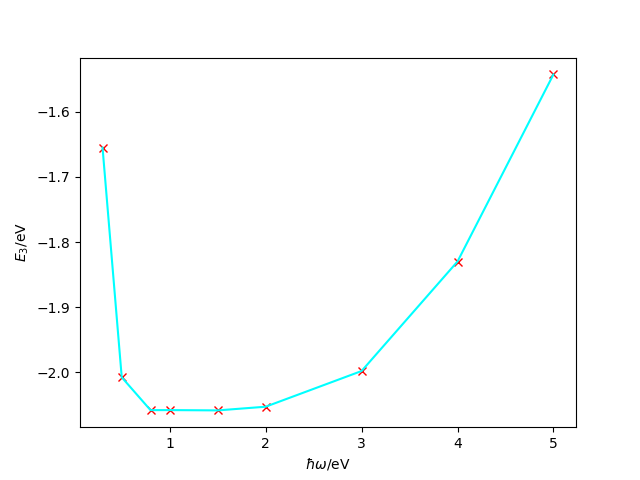
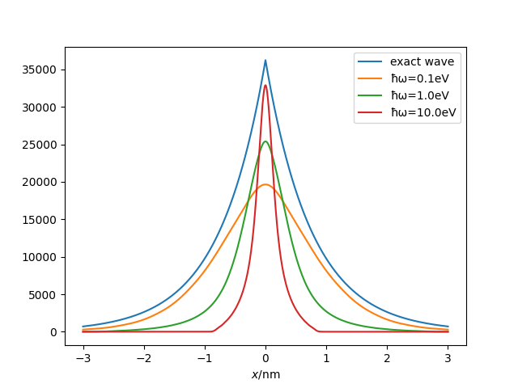

# 一维薛定谔方程（其三） 

上一节我们留了一个未解决的问题：$\hbar\omega$的选取对结果的影响。现在我们就来讨论一下这个问题。

## （类）Woods-Saxon势

在原子核物理中，核子受到的平均势场通常会用Woods-Saxon势来描述。不过这是一个三维的势阱，我们之后讲三维空间薛定谔方程时再讨论。这里我们用一个数学形式类似的一维势阱来讨论$\hbar\omega$对于结果的影响，这么做仅仅是为了使用一个比较光滑的势阱，避免势阱的奇异性带来数值积分的误差影响我们的讨论。
$$
V(x) = -\dfrac{V_0}{1 + \exp\left(\frac{|x| - R}{a}\right)}
$$
其中$|x| = R$处势能为$V(R) = -\frac{1}{2}V_0$，即势阱的半深宽为$2R$，原点处$V(0) \approx -V_0$。

我们使用前面两节的讲过的两种方法，坐标空间离散化和谐振子基矢展开，来分别计算该势阱的本征态。

代码如下
```julia
using LinearAlgebra
using PyPlot
using SpecialFunctions # gamma
using FastGaussQuadrature # gausshermite
using ClassicalOrthogonalPolynomials # Hermite

const ħ = 1.05457e-34
const mₑ = 9.10938e-31
const eV = 1.60217e-19
const nm = 1e-9

# 有限深方势阱参数
const V₀ = 5eV
const R = 0.5nm
const a = 0.1nm

# 谐振子基矢参数
const ħω = 0.8eV
const α = √(mₑ * ħω) / ħ

# 空间离散化点数（实际是 2N + 1）
const N = 10000

function V_ws(x::AbstractFloat)
    -V₀ / (1 + exp((abs(x) - R) / a))
end

function Nn(n)
    √(α / (√π * exp2(n) * gamma(n+1)))
end

function Nmn(m, n)
    1. / √(π * exp2(m+n) * gamma(m+1) * gamma(n+1))
end

function V_mat(V::Function, nmax::Integer)
    Vmat = zeros(nmax, nmax)
    # 由于厄米多项式的震荡性质，这里离散点数最好多一点
    ξ, w = gausshermite(1000)
    v = @. V(ξ/α)
    Hxn = Hermite()[ξ, 1:nmax]

    for m = 1:nmax
        for n = m:nmax
            Vmat[m, n] = sum(@. v * Nmn(m-1,n-1) * w * Hxn[:, m] * Hxn[:, n])
        end
    end
    return Symmetric(Vmat)
end

function solve_1d_ho(V::Function, nmax::Integer)
    T = zeros(nmax, nmax)
    for n = 1:nmax
        T[n, n] = 0.5ħω * (n - 0.5) # julia 下标是从 1 开始的，但是谐振子 n 是从 0 开始的
        if n+2 <= nmax
            T[n, n+2] = -0.25ħω * √(n*(n+1))
        end
    end
    H = Symmetric(T) + V_mat(V, nmax)
    eigen(H, -V₀, 0)
end

function solve_1d_space(V::Function, x0::AbstractFloat)
    @assert x0 > 0
    Δx = x0/N
    x = -x0:Δx:x0
    t = ħ^2 / (2mₑ * Δx^2)
    d = @. V(x) + 2t
    H = SymTridiagonal(d, -t * ones(length(x)-1))
    eigen(H, -V₀, 0.)
end

function test_ho()
    clf()
    println("solve with harmonic oscillator basis")
    println("ħω = ", ħω / eV, "eV")
    nmax = 10
    vals, vecs = solve_1d_ho(V_ws, nmax)
    x = collect(-3nm:0.001nm:3nm)
    ξ = α * x
    Hxn = Hermite()[ξ, 1:nmax]
    wx = @. exp(-0.5ξ^2)
    nn = @. Nn(1:nmax)
    ψxn = @. Hxn * wx * nn'
    wave = ψxn * vecs
    for (i, e) in enumerate(vals)
        println("$(i)th bound state energy is $(e/eV)eV")
        plot(x./nm, wave[:, i], label="$(i)th state")
    end
    legend()
    xlabel(raw"$x$/nm")
    savefig("woods-saxon-ho.png")
end

function test_space()
    clf()
    println("solve with space basis")
    x0 = 3nm
    x = collect(-x0:x0/N:x0) ./ 1nm
    vals, vecs = solve_1d_space(V_ws, x0)
    for (i, e) in enumerate(vals)
        println("$(i)th bound state energy is $(e/eV)eV")
        plot(x, vecs[:, i], label = "$(i)th state")
    end
    xlabel(raw"$x$/nm")
    legend()
    savefig("woods-saxon-space.png")
end

test_ho()
test_space()
```

结果如下
```text
solve with harmonic oscillator basis
ħω = 0.8eV
1th bound state energy is -4.4612315838559855eV
2th bound state energy is -3.340720084323186eV
3th bound state energy is -2.0581341565847344eV
4th bound state energy is -0.8383136344029672eV
5th bound state energy is -0.00041718806399415614eV
solve with space basis
1th bound state energy is -4.461346737706644eV
2th bound state energy is -3.3413016154522017eV
3th bound state energy is -2.059058366825876eV
4th bound state energy is -0.8406886877422717eV
5th bound state energy is -0.04405056723805582eV
```



## $\hbar\omega$依赖

如果我们用不同的$\hbar\omega$来计算，结果会有什么变化呢？以第三个本征态为例（为了突出变化），在不同的$\hbar\omega$下的计算结果如下图



可以看到在$\hbar\omega = 1 \rm{eV}$附近的才比较接近坐标空间的结果，而两边计算的能量都偏高。实际上，只有$\hbar\omega = 0.8\rm{eV}$是才能够计算出第5个束缚态，而当$\hbar\omega = 5\rm{eV}$是，只能计算出三个束缚态。

这一现象背后的原因，可以从波函数的展开来理解。

$\hbar\omega$越小，谐振子势阱越“软”，谐振子基的波函数波长越长。当波长过于长时，因为我们采用的是截断的谐振子基，这部分基矢都是缓变的长波，无法描述出真实波函数的细致结构。因此用长波展开真实波函数必然损失了信息，使得结果不精确。

$\hbar\omega$越大，谐振子势阱越“硬”，谐振子基的波函数波长越短。注意谐振子波函数有$\exp(-\alpha^2x^2)$项在无穷远处是衰减的，波长越短意味着谐振子基越局促（范围越小）。由于我们采用的是截断的谐振子基，都是一些局促在原点附近的波函数，如果它们的范围比我们的体系范围（势阱范围）还要小，那么这些短波也无法描述好真实的波函数。

如果我们能够取全部的谐振子基，那么所有这些问题都不存在。正是由于我们不得不使用截断的基来展开真实的体系，就不得不面对这些问题。选择合适的基矢参数，是基矢展开方法无法回避的问题。

（上述理解方式是从坐标空间来讨论的，从动量（或能量）的角度也可以进行类似的讨论。）

## $\delta$势阱

一个非常有意思的事情是使用谐振子基矢来展开$\delta$势阱。我们知道$\delta$势阱有一个束缚态，我们可以试着计算一下。

设$\delta$势阱为$V(x) = -\gamma \delta(x)$，于是势能矩阵元为
$$
V_{mn} = -\gamma\int \psi_m(x) \delta(x) \psi_n(x) dx = -\gamma \psi_m(0) \psi_n(0) = -\gamma N_{m}N_n H_m(0)H_n(0)
$$

其束缚态能量为：$-m \gamma^2/2\hbar^2$，波函数指数衰减的特征长度$L = \hbar^2/m\gamma$。（参考曾谨言《量子力学》（卷一））

```julia
using LinearAlgebra
using PyPlot
using SpecialFunctions # gamma
using ClassicalOrthogonalPolynomials # hermiteh

const ħ = 1.05457e-34
const mₑ = 9.10938e-31
const eV = 1.60217e-19
const nm = 1e-9

# 势阱参数
const γ = 0.1eV * nm

function Nn(n, ħω)
    α = √(mₑ * ħω) / ħ
    √(α / (√π * exp2(n) * gamma(n+1)))
end

function solve_delta(nmax::Integer, ħω::AbstractFloat)
    T = zeros(nmax, nmax)
    V = zeros(nmax, nmax)
    for n = 1:nmax
        T[n, n] = 0.5ħω * (n - 0.5) # julia 下标是从 1 开始的，但是谐振子 n 是从 0 开始的
        if n+2 <= nmax
            T[n, n+2] = -0.25ħω * √(n*(n+1))
        end
    end
    for m = 1:nmax
        for n = m:nmax
            V[m, n] = -γ * Nn(m-1, ħω) * Nn(n-1, ħω) * hermiteh(m-1, 0.) * hermiteh(n-1, 0.)
        end
    end
    H = Symmetric(T + V)
    eigen(H, 1:1)
end

function main()
    exact_energy = -mₑ * γ^2 / 2ħ^2
    L = ħ^2 / (mₑ * γ) # characteristic length
    println("exact solution: energy is ", exact_energy / eV, "eV")
    println("characteristic length is ", L / nm, "nm")

    x = collect(-3nm:0.001nm:3nm)
    exact_wave = @. exp(-abs(x)/L) / √L
    plot(x / nm, exact_wave, label="exact wave")
    
    nmax = 50
    for ħω in [0.1, 1, 10] * eV
        vals, vecs = solve_delta(nmax, ħω)
        println("solve with ħω = $(ħω/eV)eV, E = $(vals[1]/eV)eV")
        α = √(mₑ * ħω) / ħ
        ξ = α * x
        Hxn = Hermite()[ξ, 1:nmax]
        wx = @. exp(-0.5ξ^2)
        nn = @. Nn(1:nmax, ħω)
        ψxn = @. Hxn * wx * nn'
        wave = ψxn * vecs
        plot(x / nm, abs.(wave[:, 1]), label="ħω=$(ħω/eV)eV")
    end
    legend()
    xlabel(raw"$x$/nm")
    savefig("delta-wave.png")
end

main()
```

结果如图



这个结果非常好的体现了长波能够描述体系轮廓，但是无法描述细节；短波能够描述细节，但是过于局促无法覆盖真实体系的特点。