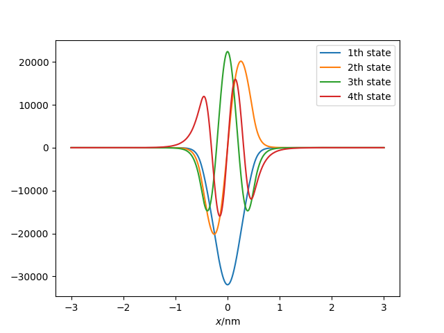

# 一维薛定谔方程（其二）

除了坐标空间离散化之外，使用基矢展开也是量子力学的数值求解常用的一种方法。有限深方势阱和谐振子势阱有一定的相似性，其束缚态可以使用谐振子基矢展开来求解。

## 一维谐振子基矢

一维谐振子的哈密顿量为（参考曾谨言《量子力学》（卷一）3.4）
$$
H = \dfrac{p^2}{2m} + \dfrac{1}{2}m\omega^2 x^2
$$
令
$$
\alpha = \sqrt{m\omega/\hbar}, \quad \xi = \alpha x
$$
则谐振子波函数为
$$
\psi_n(x) = N_n \exp(-\frac{1}{2}\alpha^2x^2) H_n(\alpha x) = N_n \exp(-\frac{1}{2}\xi^2) H_n(\xi)
$$
其中$H_n(\xi)$是厄米多项式，波函数归一化系数
$$
N_n = \left(\dfrac{\alpha}{\sqrt{\pi}2^n n!}\right)^{1/2}
$$

谐振子基矢满足正交归一性
$$
\int \psi_m(x) \psi_n(x) dx = \delta_{mn}
$$

## 一维势阱在谐振子基矢下的表示

对于任意一个一维势阱$V(x)$，哈密顿量为
$$
H = \dfrac{p^2}{2m} + V(x)
$$
动量项在谐振子基矢下的矩阵元很容易通过升降算符或者直接求导得到
$$
T_{mn} = \int \psi_m(x) \dfrac{p^2}{2m} \psi_n(x) dx = \dfrac{\hbar\omega}{4} [(2n+1)\delta_{mn} - \sqrt{n(n-1)}\delta_{m,n-2} - \sqrt{(n+1)(n+2)}\delta_{m,n+2}]
$$

困难在于计算$V(x)$在谐振子基矢下的矩阵元
$$
V_{mn} = \int \psi_m(x) V(x) \psi_n(x) dx
$$
这个数值积分是有一定难度的，因为厄米多项式是一个震荡的函数，需要小心处理以避免数值误差。

对于一般的势阱进行计算，上式可以化为
$$
\begin{aligned}
V_{mn} &= N_m N_n\int \exp(-\frac{1}{2}\xi^2) H_m(\xi) V(\xi/\alpha) \exp(-\frac{1}{2}\xi^2) H_n(\xi) \dfrac{1}{\alpha} d\xi \\
    &= N_{mn} \int \exp(-\xi^2) H_m(\xi) V(\xi/\alpha) H_n(\xi) d\xi
\end{aligned}
$$
其中
$$
N_{mn} = \sqrt{\dfrac{1}{\pi}2^{n+m}m!n!}
$$

这是一个无穷积分，没法用普通的牛顿积分来计算，这类积分通常可以使用高斯积分法。特别地，这里的权重函数是$\exp(-\xi^2)$，是厄米多项式的权重函数，所以又叫高斯——厄米积分。

高斯积分的基本思想为
$$
\int \omega(x) f(x) dx \approx \sum_i w_i f(x_i)
$$
即将带权重函数的积分，根据权重函数的性质得到离散点$x_i$和对应点的权重$w_i$。关于高斯积分的具体算法理论，请参考任意一本计算物理或者计算方法的教材，在此不再赘述。

## 一维有限深方势阱的计算

我们依然在一维有限深方势阱上验证我们的计算结果，代码如下
```julia
using LinearAlgebra
using PyPlot
using SpecialFunctions # gamma
using FastGaussQuadrature # gausshermite
using ClassicalOrthogonalPolynomials # Hermite

const ħ = 1.05457e-34
const mₑ = 9.10938e-31
const eV = 1.60217e-19
const nm = 1e-9

# 有限深方势阱参数
const V₀ = 5eV
const a = 1nm

# 谐振子基矢参数
const ħω = 2eV
const α = √(mₑ * ħω) / ħ

function V_well(x::AbstractFloat)
    abs(x) < a / 2 ? -V₀ : 0.
end

function Nn(n)
    √(α / (√π * exp2(n) * gamma(n+1)))
end

function Nmn(m, n)
    1. / √(π * exp2(m+n) * gamma(m+1) * gamma(n+1))
end

function V_mat(V::Function, nmax::Integer)
    Vmat = zeros(nmax, nmax)
    # 由于厄米多项式的震荡性质，这里离散点数最好多一点
    ξ, w = gausshermite(1000)
    v = @. V(ξ/α)
    Hxn = Hermite()[ξ, 1:nmax]

    for m = 1:nmax
        for n = m:nmax
            Vmat[m, n] = sum(@. v * Nmn(m-1,n-1) * w * Hxn[:, m] * Hxn[:, n])
        end
    end
    return Symmetric(Vmat)
end

function solve_1d(V::Function, nmax::Integer)
    T = zeros(nmax, nmax)
    for n = 1:nmax
        T[n, n] = 0.5ħω * (n - 0.5) # julia 下标是从 1 开始的，但是谐振子 n 是从 0 开始的
        if n+2 <= nmax
            T[n, n+2] = -0.25ħω * √(n*(n+1))
        end
    end
    H = Symmetric(T) + V_mat(V, nmax)
    eigen(H, -V₀, 0)
end

function main()
    nmax = 50
    vals, vecs = solve_1d(V_well, nmax)
    x = collect(-3nm:0.001nm:3nm)
    ξ = α * x
    Hxn = Hermite()[ξ, 1:nmax]
    wx = @. exp(-0.5ξ^2)
    nn = @. Nn(1:nmax)
    ψxn = @. Hxn * wx * nn'
    wave = ψxn * vecs
    for (i, e) in enumerate(vals)
        println("$(i)th bound state energy is $(e/eV)eV")
        plot(x./nm, wave[:, i], label="$(i)th state")
    end
    legend()
    xlabel(raw"$x$/nm")
    show()
end

main()
```

计算结果为
```text
1th bound state energy is -4.722410217789267eV
2th bound state energy is -3.8999492310640633eV
3th bound state energy is -2.572350931478065eV
4th bound state energy is -0.8673533950411015eV
```


### 结果讨论

和上一篇文章使用空间离散化求解方法进行对比，可以看到结果近似程度并不是那么完美，不过在一定程度上还算可以接受吧。此外，上一篇的波函数是没有归一化的，而这里是自然归一化的，因为谐振子基矢是归一化的。

虽然谐振子基矢展开和上一节的坐标空间离散化相比，似乎效果并不好。但是，如果变成三维空间，甚至量子多体系统，那么坐标空间的离散化将会变得非常困难，而基矢展开方法始终会是一个非常有用的方法。

除此之外还有很多值得讨论的内容。

- 我们这里使用了截断的谐振子基矢，最大激发态为$nmax = 50$。由于谐振子基矢有无穷多，我们当然不可能使用完备基。系统低激发态在谐振子基矢上展开，谐振子高激发态的成分应该也比较少，基于这个物理原理，通常使用部分截断的谐振子基矢，对于系统低激发态的性质可以进行比较好的描述。当然，另外一方面，由于厄米多项式的震荡性，高激发态的谐振子基矢也会使得势能矩阵元的数值积分变得困难，所以实际上也不太可能取特别高的截断。
- $\hbar\omega$的选取。实际上这里我随意选取了一个 2eV 的谐振子，这是有一定任意性的。方势阱函数有点奇异性，积分造成的误差有点不确定性。之后我们用另一个例子讨论$\hbar\omega$的选取对于结果的影响。

## 关于Julia语言的备注

本节我们用到了三个新的包，其中`SpecialFunctions`部分内容在 Julia 0.x 版本是内置的，现在成为了一个独立的包。不过它目前包含的特殊函数还不是很全面，比不上python的scipy等库。`FastGaussQuadrature`是用于高斯积分的一个库，除了厄米多项式权重之外，还包含了其他几种权重函数，感兴趣可以取github上看看。`ClassicalOrthogonalPolynomials`则实现了一些正交多项式，借助于Julia的惰性数组，它能够实现一些不明觉厉的功能，这里我用来生成谐振子波函数了。